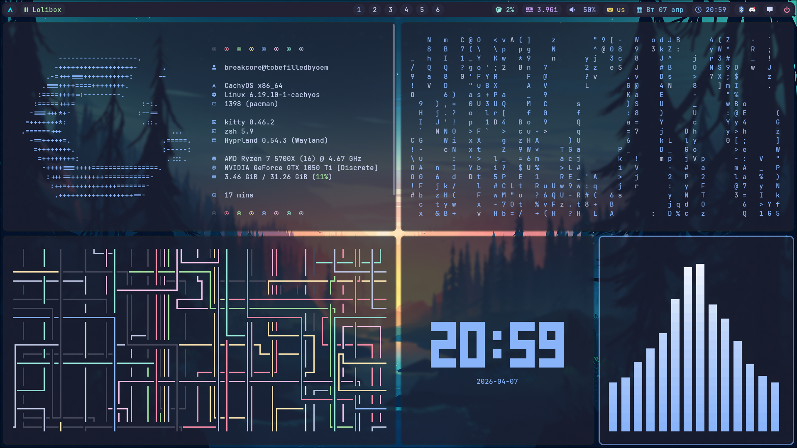
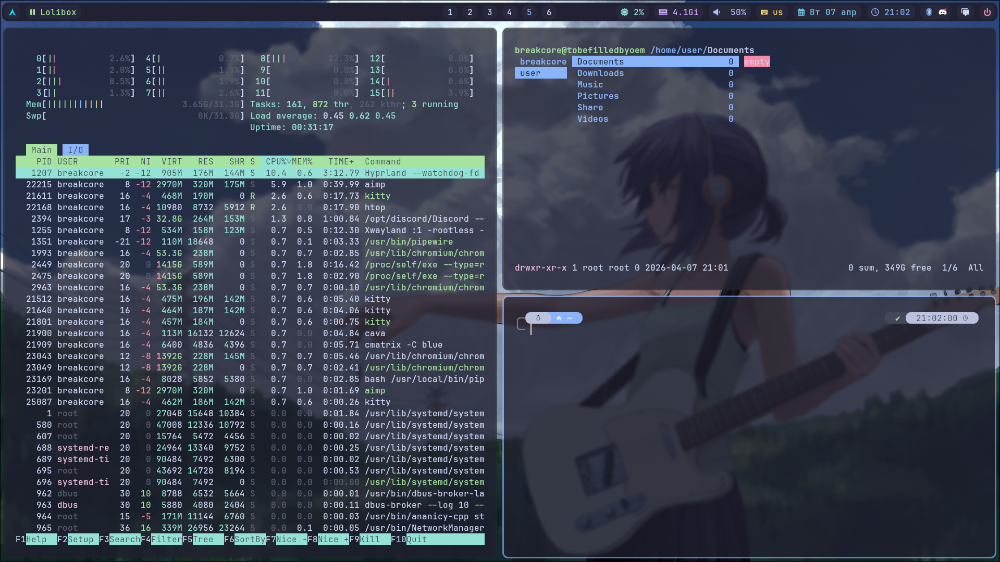

### Простые дотфайлы
#
**Основной терминал** Alacritty<br>
**Второй терминал** Kitty<br>
**Проводник** Ranger<br>
**Лаунчер приложений** fuzzel<br>
**Шелл** zsh<br>

**Панелька** Waybar<br>
**Менеджер уведомлений** Swaync<br>
**Менюшка для выхода из сессии** Wlogout<br>
**Демон обоев** Awww<br>


### Установка
#
```
git clone https://github.com/pharaa/hyprland-dots.git
cd hyprland-dots
```

Отредактируйте "config/hypr/hyprland/monitors.conf" и пропишите там свои мониторы из hyprctl monitors<br>

При желании вы можете поменять аватарку на экране блокировки, переименовав картинку в .avatar и поместить её в вашу папку /home/

#### Запустите билдер:
```
python builder/main.py
```
### Бинды
#
Win + Q - Открыть терминал (alacritty)<br>
Win + E - Открыть проводник<br>
Win + R - Открыть лаунчер приложений<br>
Win + N - Открыть nvtop<br>
Win + H - Открыть htop<br>
Win + C - Закрыть окно<br>
Win + V - Переключение тайлинга для окна<br>

Win + Alt + R - Открыть буфер обмена<br>
Win + Alt + W - Вайпнуть буфер обмена<br>
Win + Alt + C - Открыть браузер (chromium)<br>
Win + Alt + P - Открыть лаунчер майнкрафта (prism)<br>

PrintScreen - Открыть меню скриншотов<br>
Win + PrintScreen - Быстрый скриншот области<br>
Win + Alt + PrintScreen - Выбрать цвет с экрана<br>

Win + Shift + Стрелочки - Двигать окошки

### Алиасы
#
**c** - clear<br>
**q** - закрыть терминал<br>
**p** - вывести текущую директорию<br>
**cls** - clear + fastfetch<br>
**ff** - fastfetch<br>
**update** - обновление системы<br>
**rds** - удаление пакетов сирот<br>
**root** - получение root-прав<br>
**rscfg** - перезагрузка конфигов<br>

### Скриншоты
#



